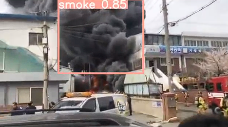
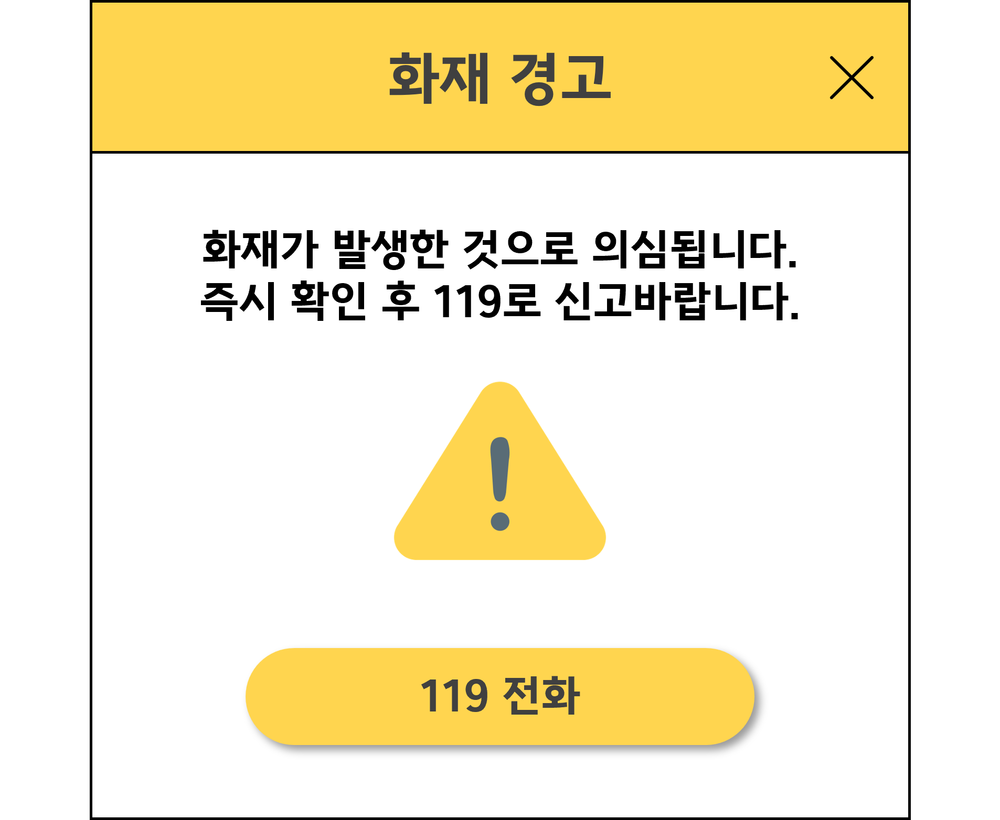
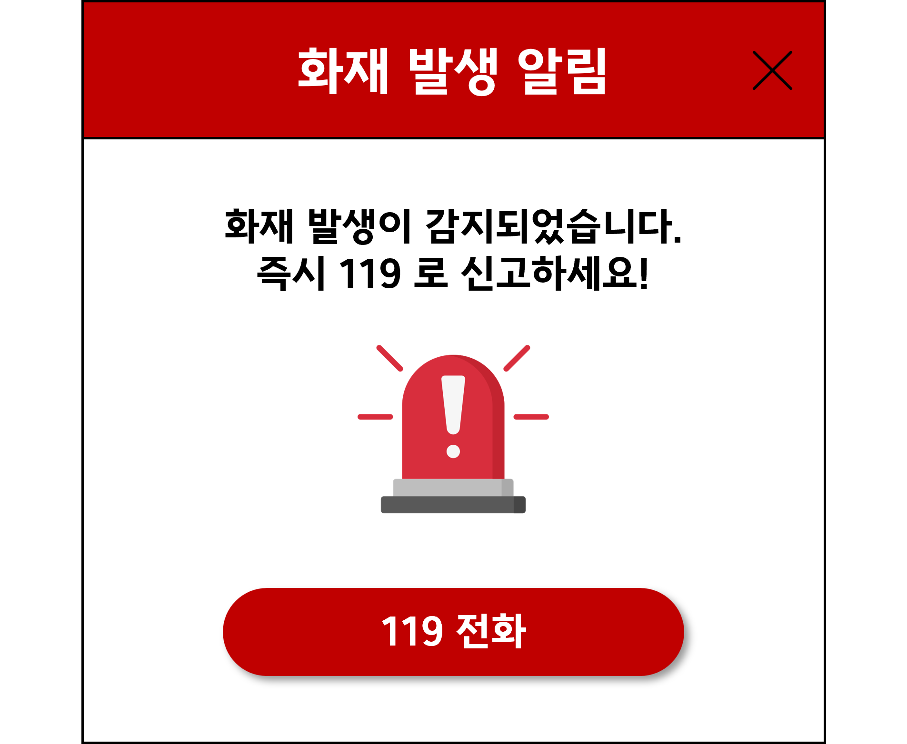

# 프로젝트 개요

일반 소시민들이 가게를 운영하며 자리를 비웠을때 발생하는 화재를 감지하여 바로 신고해주기 위한 프로젝트

> CCTV화면을 영역으로 설정하여 그 안에서의 픽셀단위의 불을 탐지한다.
 

# 🔥 Skills

## AI

  &nbsp;&nbsp;
  &nbsp;&nbsp;
  

## Front-End

  

## Tools

  &nbsp;&nbsp;
  &nbsp;&nbsp;
  &nbsp;&nbsp;

# 사용 방법

> 1. [다운로드 클릭](https://drive.google.com/file/d/14ObT1cmKxJP_9W_44OrceHMYzoIo8ZU-/view?usp=drive_link) 후 폴더안의 run.zip 압축을 해제하여

> 2. 그 안의 run.exe 파일을 실행한다.

> 3. 원하는 영역만큼  왼쪽 위에서 오른쪽 아래로 드래그 하여 cctv화면(동영상의 화면)의 크기에 맞춰주고

> 4. 테스트 해볼 영상을 재생하거나 띄워준다.

# 미리보기

 

## 화재 의심이 될때  경고문

 

## 화재 발생시 경고문

